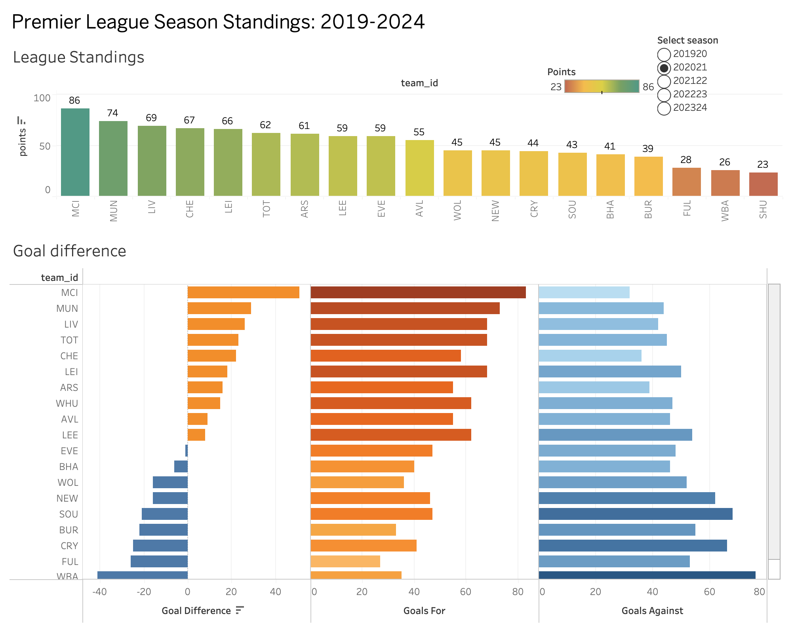
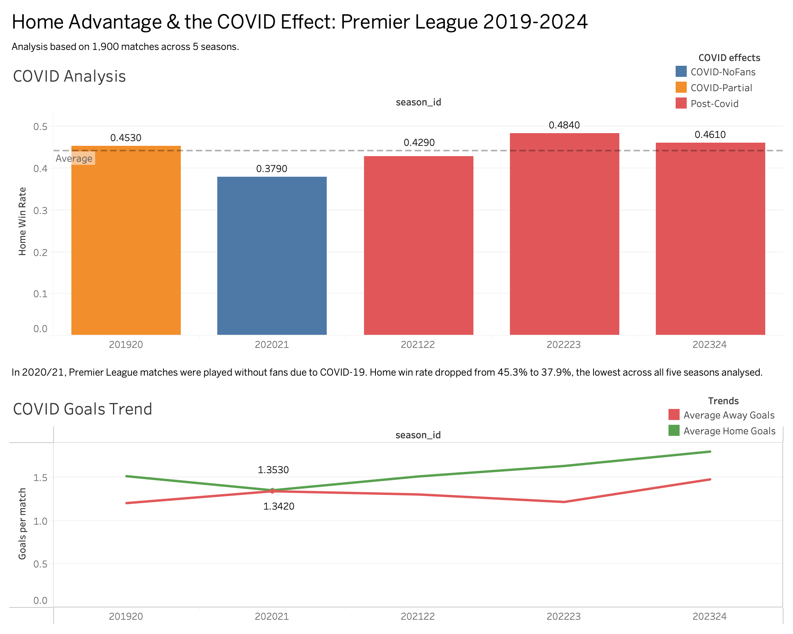
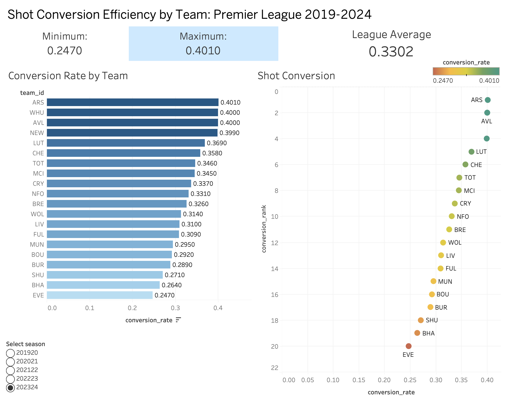

# premier-league-analytics

This is a Premier League Analytics Dashboard, a relational PostgreSQL database populated from real match data, queried with analytical SQL, and visualised in Tableau. With 1900 matches across 5 seasons, there are lots of insights to be unearthed.

Tech Stack: Database: PostgreSQL (local install) Ingestion: Python with pandas and SQLAlchemy Visualisation: Tableau (connected live to PostgreSQL, no CSV exports) Data source: football-data.co.uk, free CSV downloads, 5 recent Premier League seasons (2019/20 through 2023/24)

Database Schema:  teams: Has details on the team abbreviation ID, full name, city, stadium and founded year.  seasons: Has season ID based on years, full season label, start and end dates. matches: Unique serial ID for each match, corresponding to each season, date of kick off, home and away team IDs, stats like goals scored, shots taken, shots on target, corners and bookings. standings: Standing tables for each season, with matches played, total number of wins, draws and losses, goals for and against, goal difference and points.

8 queries:

1. Derived the full league table from match results using GROUP BY, CASE WHEN for points, ORDER BY points, goal difference.
2. Average home win rate and goals scored for home and away per season to examine the home advantage effect.
3. Derived a form table over the last 6 games for each team at each point in the season using ROW NUMBER() OVER (PARTITION BY team ORDER BY match_date) and CTEs.
4. Analysed shot conversion efficiency and ranked using RANK() OVER (PARTITION BY season ORDER BY conversion_rate DESC).
5. Analysed historical head to head records of any two teams, getting the total wins, draws, losses, goals for and against.
6. Analysed the highest scoring match combinations by most goals per game on average, filtered for having met at least 4 times for more reliable results.
7. Rolling discipline analysis of each team per season using AVG() OVER (PARTITION BY team ORDER BY season ROWS BETWEEN 2 PRECEDING AND CURRENT ROW).
8. Analysed the effect of COVID, comparing home win rates in the 2019/20 and 2020/21 seasons against surrounding seasons by doing difference-in-differences.

The most interesting results were:
how MCI performed at a consistent high level, ranking top 2 for shot conversion in 4 of the 5 seasons, 
the effect of COVID on performance, seeing the home win rate dropping from 45.3% to 37.9% in the 2020/21 season where there were no fans, before increasing back to 48.4% in 2022/23
Sheffield United were the worst performing club in a season in the dataset, getting 16 points with -69 goal difference in 2023/24 season. 

How to run: 

* Clone the repo
* Install dependencies — `pip install pandas sqlalchemy psycopg2-binary`
* Create the database — `createdb prem_analytics`
* Run schema — `psql -d prem_analytics -f schema.sql`
* Run ingestion — `python3 ingest.py`

Screenshots:

